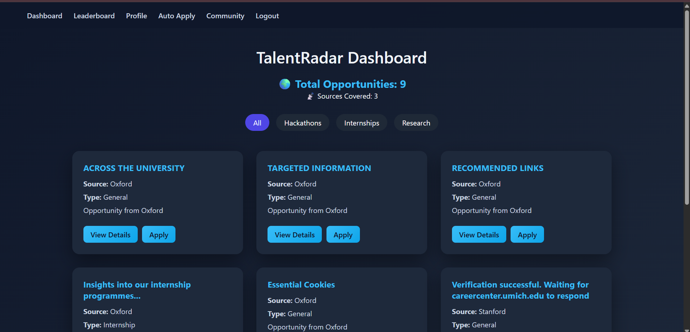

<div align="center">

# 🎯 TalentRadar
### Student Opportunity Intelligence System

[](https://python.org)
[](https://djangoproject.com)
[](https://sqlite.org)
[](LICENSE)

> **TalentRadar** is an intelligent web platform that connects students with the right opportunities — internships, scholarships, competitions, and career pathways — through smart matching and real-time intelligence.

</div>

---

## 📌 Table of Contents

- [Overview](#-overview)
- [Features](#-features)
- [Tech Stack](#-tech-stack)
- [Project Structure](#-project-structure)
- [Getting Started](#-getting-started)
- [Configuration](#-configuration)
- [Usage](#-usage)
- [Contributing](#-contributing)
- [License](#-license)

---

## 🧭 Overview

TalentRadar is a Django-based Student Opportunity Intelligence System designed to bridge the gap between students and relevant academic and professional opportunities. By aggregating, filtering, and intelligently surfacing opportunities based on student profiles and interests, TalentRadar acts as a personal opportunity radar for every student.

Whether it's a scholarship deadline, an internship opening, or a hackathon — TalentRadar keeps students ahead of the curve.

---

## ✨ Features

- 🔍 **Opportunity Discovery** — Browse and search curated internships, scholarships, competitions, and programs
- 🧠 **Intelligence Layer** — Smart filtering and matching based on student profiles and preferences
- 👤 **Student Profiles** — Personalized dashboards with tracked opportunities and saved listings
- 📋 **Application Tracking** — Monitor the status of opportunity applications in one place
- 🏛️ **Admin Panel** — Full Django admin interface for managing opportunities, users, and platform data
- 📱 **Responsive UI** — Clean, mobile-friendly interface built with HTML, CSS, and JavaScript
- 🔐 **Authentication** — Secure user registration, login, and session management

---

## 🛠 Tech Stack

| Layer | Technology |
|-------|-----------|
| Backend | Python, Django |
| Frontend | HTML5, CSS3, JavaScript |
| Database | SQLite (development) |
| Templating | Django Templates |
| Static Files | Django Static Files |

---

## 📁 Project Structure

```
TalentRadar/
├── ivyintel/              # Main Django project (settings, URLs, WSGI)
│   ├── settings.py
│   ├── urls.py
│   └── wsgi.py
├── core/                  # Core application logic
│   ├── models.py          # Database models
│   ├── views.py           # View controllers
│   ├── urls.py            # URL routing
│   └── admin.py           # Admin configurations
├── templates/             # HTML templates
├── static/                # CSS, JavaScript, images
├── Ivenv/                 # Virtual environment (excluded from deployment)
├── db.sqlite3             # SQLite database (development)
└── manage.py              # Django management entry point
```

---

## 🚀 Getting Started

### Prerequisites

- Python 3.10 or higher
- pip (Python package manager)
- Git

### Installation

**1. Clone the repository**

```bash
git clone https://github.com/Minhaj078/TalentRadar_Student-Opportunity-Intelligence-System.git
cd TalentRadar_Student-Opportunity-Intelligence-System
```

**2. Create and activate a virtual environment**

```bash
# Windows
python -m venv venv
venv\Scripts\activate

# macOS / Linux
python3 -m venv venv
source venv/bin/activate
```

**3. Install dependencies**

```bash
pip install -r requirements.txt
```

> If `requirements.txt` is not present, install Django manually:
> ```bash
> pip install django
> ```

**4. Apply database migrations**

```bash
python manage.py migrate
```

**5. Create a superuser (admin account)**

```bash
python manage.py createsuperuser
```

**6. Run the development server**

```bash
python manage.py runserver
```

**7. Open your browser and navigate to:**

```
http://127.0.0.1:8000/
```

Admin panel is available at:

```
http://127.0.0.1:8000/admin/
```

---

## ⚙️ Configuration

Key settings can be found in `ivyintel/settings.py`. For production deployments, make sure to:

- Set `DEBUG = False`
- Configure a proper `SECRET_KEY` via environment variables
- Set `ALLOWED_HOSTS` to your domain
- Switch to a production-grade database (e.g., PostgreSQL)
- Configure static files with `collectstatic`

Example using environment variables:

```python
import os

SECRET_KEY = os.environ.get('DJANGO_SECRET_KEY', 'your-default-dev-key')
DEBUG = os.environ.get('DEBUG', 'False') == 'True'
ALLOWED_HOSTS = os.environ.get('ALLOWED_HOSTS', 'localhost').split(',')
```

---

## 🖥️ Usage

Once the server is running:

1. **Register** as a new student user or log in with existing credentials
2. **Set up your profile** with academic background and interests
3. **Browse opportunities** filtered by category, deadline, or field
4. **Save or apply** to opportunities directly from the platform
5. **Track applications** via your personalized dashboard
6. **Admins** can log into `/admin` to add, edit, or remove opportunities and manage users

---

## 🤝 Contributing

Contributions are welcome! To contribute:

1. Fork the repository
2. Create a feature branch: `git checkout -b feature/your-feature-name`
3. Commit your changes: `git commit -m "Add: your feature description"`
4. Push to your branch: `git push origin feature/your-feature-name`
5. Open a Pull Request

Please ensure your code follows PEP 8 style guidelines and includes appropriate comments.

---

## 📸 Application Snapshots

### 🏠 Dashboard


---

### 📊 AI Analytics


---


## 📄 License

This project is licensed under the [MIT License](LICENSE). You are free to use, modify, and distribute this software with attribution.

---

<div align="center">

Built with ❤️ by [Minhaj078](https://github.com/Minhaj078)

</div>
